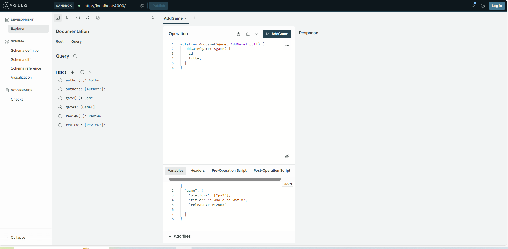
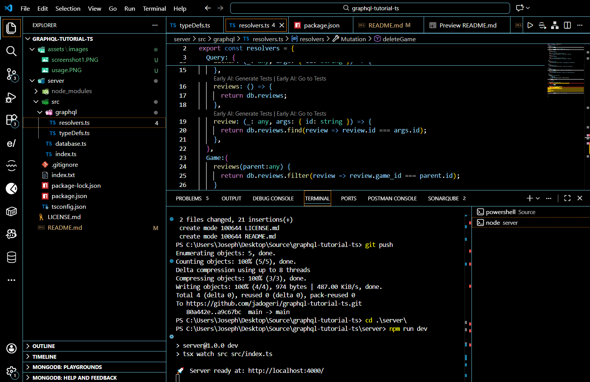
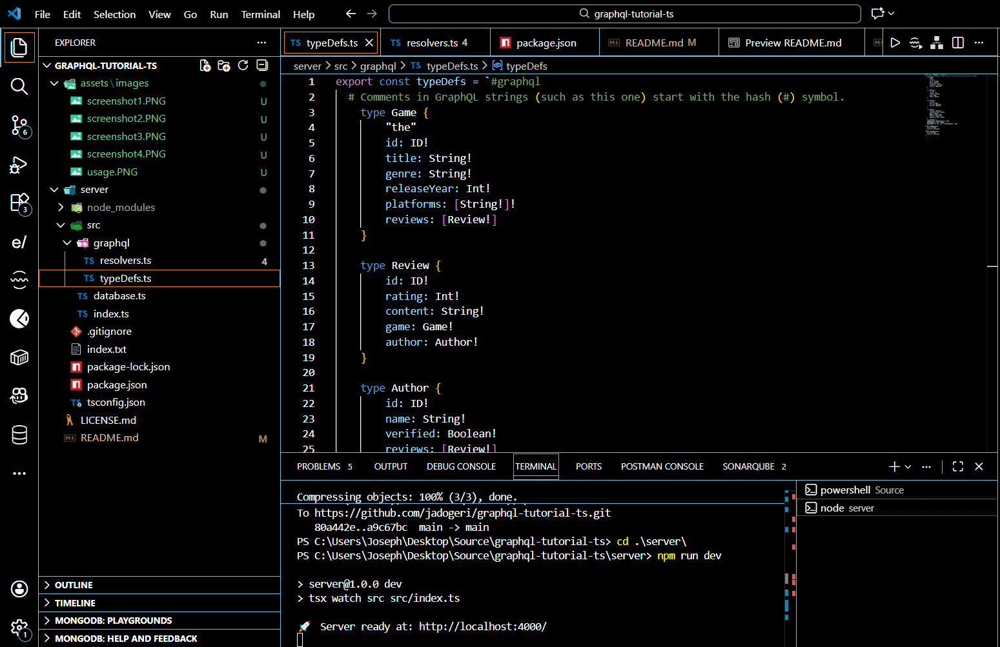
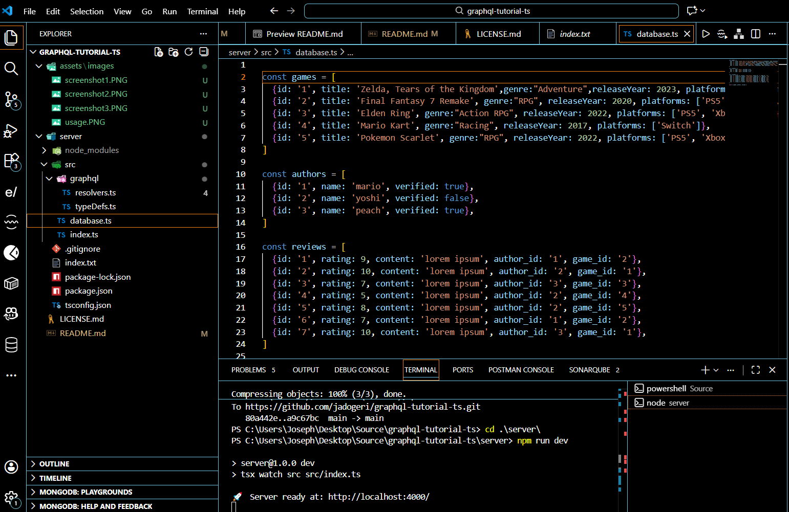
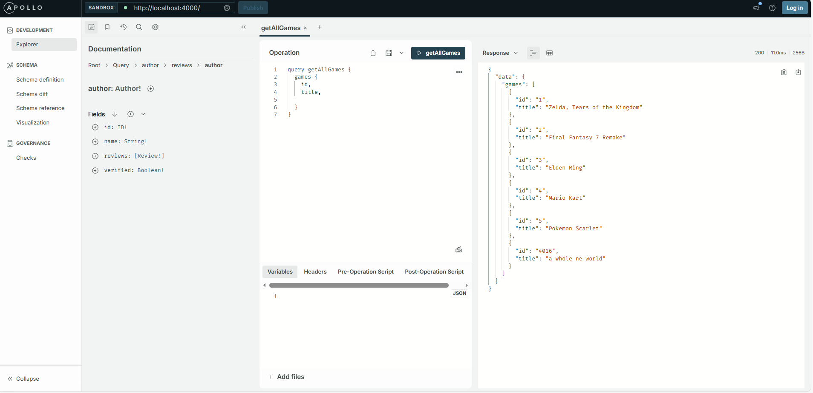

## **GRAPHQL TUTORIAL TS**

**Version:** 1.0.0
**Date:** January 11, 2026

---


## Description

This is a beginner friendly backend application (typescript) to utilize graphql for data retrieval or modification.

## Authors

- [@jadogeri](https://www.github.com/jadogeri)

## Acknowledgements

- Design and template by [FreeCodeCamp / Net Ninja](https://www.youtube.com/watch?v=5199E50O7SI)


## Repository

- [source code ](https://github.com/jadogeri/graphql-tutorial-ts.git)

## Screenshots

---

|  |  |
| -------------------------------------------- | -------------------------------------------- |
|  |  |

## Table of Contents

<ul>
      <li><a href="#1-introduction">1. Introduction</a>
        <ul>
          <li><a href="#11-purpose">1.1 Purpose</a> </li>
        </ul>
      </li>
    </ul>
     <ul>
      <li><a href="#5-installation">2. Installation</a>
      </li>
    </ul> 
    <ul>
        <li><a href="#6-usage">3. Usage</a>
        <ul>
            <li><a href="#61-run-application">3.1 Run Application</a> </li>
            <ul>
              <li><a href="#611-run-locally">3.1.1 Run Locally</a> </li>
            </ul>
        </ul>
        </li>
    </ul> 
    <ul> 
        <li><a href="#10-references">4. References</a>
        </li>
    <ul>
</ul>

## **1. Introduction**

### **1.1 Purpose**

This document outlines the components, and design considerations for retrieving data using graphql from an express app.

Note: Mutations performed during session will not persist once server restarts. This app is for learning purpose.

## **2. Installation**

* [Download and install NodeJS](https://nodejs.org/en/download)

---

## **3. Usage**

**Prerequisites** :installation of NodeJS.

### **3.1 Run Application**

1 Open command prompt or terminal.

2 Type command git clone https://github.com/jadogeri/graphql-tutorial-ts.git then press enter.

```bash
  git clone https://github.com/jadogeri/graphql-tutorial-ts.git
```

3 Enter command cd graphql-tutorial-ts/server then press enter.

```bash
  cd graphql-tutorial-ts/server
```

#### **3.1.1 Run Locally**

1 Type npm install --force to install dependencies.

```bash
  npm install --force
```

2 Type npm run dev to run application

```bash
  npm run dev
```

3 type or copy `http://localhost:4000` to address bar to open apollo server and run querries.



---

## **4. References**

* FreeCodeCamp : [Frontend Web Development: (HTML, CSS, JavaScript, TypeScript, React)](https://www.youtube.com/watch?v=MsnQ5uepIa).
* AweSome Open Source : [Awesome Readme Templates](https://awesomeopensource.com/project/elangosundar/awesome-README-templates)
* Readme.so : [The easiest way to create a README](https://readme.so/)
* HUXN Webdev : [Master ReactJS in 7 Hours with 10 Real-World Projects 2023](https://www.youtube.com/watch?v=XrwsMN2IWnE/)
* Dave Gray : [React JS Full Course for Beginners | Complete All-in-One Tutorial | 9 Hours](https://www.youtube.com/watch?v=RVFAyFWO4go/)
* FreeCodeCamp : [GraphQL Course for Beginners](https://www.youtube.com/watch?v=5199E50O7SI)
* Apollo Server : [GraphQL Tutorial in Typescript](https://www.apollographql.com/docs/apollo-server/getting-started)


